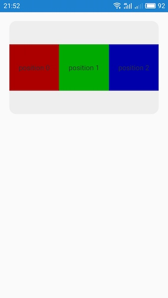
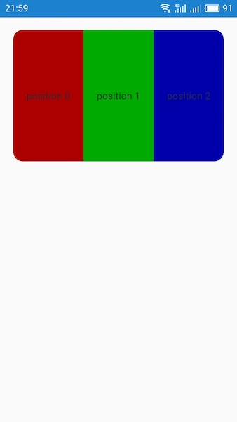
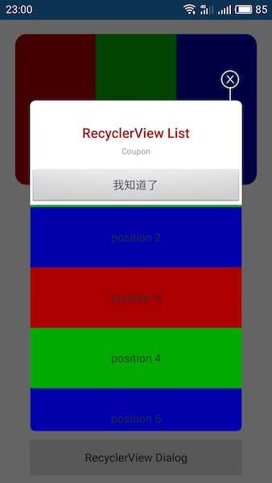

## 为何给 RecyclerView 加上四周的圆角

为了解释如何加上圆角，以及为何要通过 canvas 裁剪的方式来实现这个功能，以下步骤将一一说明问题。

1.activity_main.xml 中的 RecyclerView 给它设置一个圆角的背景

```xml
<RelativeLayout xmlns:android="http://schemas.android.com/apk/res/android"
    android:layout_width="match_parent"
    android:layout_height="match_parent"
    android:orientation="vertical">

    <android.support.v7.widget.RecyclerView
        android:id="@+id/grid3x1List"
        android:layout_width="match_parent"
        android:layout_height="wrap_content"
        android:layout_margin="20dp"
        android:scrollbars="none"
        android:background="@drawable/bg_grid3x1" />

</RelativeLayout>
```

2.item_grid3x1.xml 居中显示一个带颜色背景的 TextView，使得能够突出展现四周的圆角

```xml
<?xml version="1.0" encoding="utf-8"?>
<RelativeLayout xmlns:android="http://schemas.android.com/apk/res/android"
    android:orientation="vertical"
    android:layout_width="match_parent"
    android:layout_height="200dp">

    <TextView android:id="@+id/text"
        android:layout_width="match_parent"
        android:layout_height="100dp"
        android:layout_centerInParent="true"
        android:gravity="center"
        android:text=""
        android:textSize="15dp"
        android:textColor="#282b34"/>

</RelativeLayout>
```

3.编译运行之后，看到的效果是这样的，四周的圆角能够显示出来



4.当把 item_grid3x1.xml 中的 TextView 的高度改为 match_parent 之后，即让它占满整个 RecyclerView 控件的高度，可以看到，四周的圆角已经被遮挡了。出现这个情况是正常的，因为 RecyclerView 的背景是能够被子 View 覆盖的。So，本示例将采用 canvas 裁剪的方式来解决这个问题


## 裁剪的实现

裁剪 RecyclerView 的 canvas 不用通过自定义 RecyclerView 来实现，RecyclerView  有一个 addItemDecoration 方法能提供操纵 canvas 的能力，程序代码如下：

```java

public class RecyclerViewCornerRadius extends RecyclerView.ItemDecoration {
    public static final String TAG = "RecyclerViewCornerRadius";

    private RectF rectF;
    private Path path;

    private int topLeftRadius = 0;
    private int topRightRadius = 0;
    private int bottomLeftRadius = 0;
    private int bottomRightRadius = 0;

    public RecyclerViewCornerRadius(final RecyclerView recyclerView) {
        recyclerView.getViewTreeObserver().addOnGlobalLayoutListener(new ViewTreeObserver.OnGlobalLayoutListener() {
            @Override
            public void onGlobalLayout() {
                rectF = new RectF(0, 0, recyclerView.getMeasuredWidth(), recyclerView.getMeasuredHeight());

                path = new Path();
                path.reset();
                path.addRoundRect(rectF, new float[]{
                        topLeftRadius, topLeftRadius,
                        topRightRadius, topRightRadius,
                        bottomLeftRadius, bottomLeftRadius,
                        bottomRightRadius, bottomRightRadius
                }, Path.Direction.CCW);

                recyclerView.getViewTreeObserver().removeOnGlobalLayoutListener(this);
            }
        });
    }

    public void setCornerRadius(int radius) {
        this.topLeftRadius = radius;
        this.topRightRadius = radius;
        this.bottomLeftRadius = radius;
        this.bottomRightRadius = radius;
    }

    public void setCornerRadius(int topLeftRadius, int topRightRadius, int bottomLeftRadius, int bottomRightRadius) {
        this.topLeftRadius = topLeftRadius;
        this.topRightRadius = topRightRadius;
        this.bottomLeftRadius = bottomLeftRadius;
        this.bottomRightRadius = bottomRightRadius;
    }

    @Override
    public void onDraw(Canvas c, RecyclerView parent, RecyclerView.State state) {
        c.clipRect(rectF);
        c.clipPath(path, Region.Op.REPLACE);
    }
}
```


## 如何使用

如下，即完成裁剪 RecyclerView 四周圆角的设置

```java
    @ViewInject(R.id.grid3x1List) private RecyclerView grid3x1List = null;

    private Grid3x1Adapter grid3x1Adapter;

    @Override
    protected void onCreate(Bundle savedInstanceState) {
        super.onCreate(savedInstanceState);

        grid3x1Adapter = new Grid3x1Adapter(mActivity);
        grid3x1List.setLayoutManager(new GridLayoutManager(mActivity, 3));
        grid3x1List.setAdapter(grid3x1Adapter);

        RecyclerViewCornerRadius radiusItemDecoration = new RecyclerViewCornerRadius(grid3x1List);
        radiusItemDecoration.setCornerRadius(AppUtils.dpTopx(mActivity, 15));
        grid3x1List.addItemDecoration(radiusItemDecoration);
    }
```

最后，编译运行看到效果，四周已经有圆角了



使用这样的方式来实现四周圆角，还有一个好处是，如果某一个列表是要求以圆角对话框展现形式的，集成进去将非常方便，如：



在滑动列表的同时，还能以圆角展现，而我们仅仅通过以下代码设置就能实现

```java
    private void initUI() {
        Coupon_List = (RecyclerView) findViewById(R.id.Coupon_List);
        CouponAdapter couponAdapter = new CouponAdapter(context);
        Coupon_List.setLayoutManager(new LinearLayoutManager(context));
        Coupon_List.setAdapter(couponAdapter);

        RecyclerViewCornerRadius radiusItemDecoration = new RecyclerViewCornerRadius(Coupon_List);
        radiusItemDecoration.setCornerRadius(0, 0, AppUtils.dpTopx(context, 6.5f), AppUtils.dpTopx(context, 6.5f));
        Coupon_List.addItemDecoration(radiusItemDecoration);
    }
```


## 缺陷

别高兴的太早，仔细看那个对话框的下边圆角处，竟然有三四个像素是白色，感觉就像漏光一样。通过编程裁剪出来的圆角效果，它是有锯齿的。如果你知道如何去除锯齿，请提出一个PR，谢谢🙏
